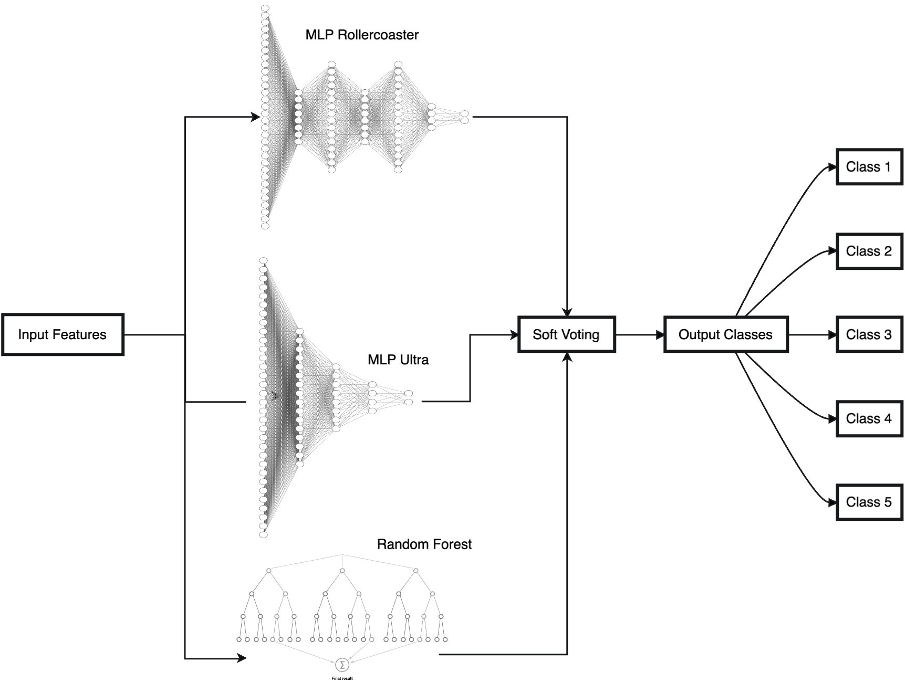

<h1 align="center">Heart Disease Recognition</h1>

  <b>A Machine Learning solution to detect heart diseases from raw audio heartbeat recordings</b>
   
  <i>Providing a prevention and support tool</i>

  <a href="#overview">Overview</a> •
  <a href="#repository-structure">Repository Structure</a> •
  <a href="#problem-description-and-goals">Problem Statement</a> •
  <a href="#methodology">Methodology</a> •
  <a href="#results">Results</a> •
  <a href="#license">License</a>

---

## Overview

This repository contains the code and resources for the project "Heart Disease Recognition from Heart Beat Audio Signals." The project aims to enhance the early detection of heart diseases using machine learning models trained on heart sound recordings. This project was developed as part of the Advanced Biomedical Machine Learning course at the University of Pavia, Italy.

## Repository Structure

- **`dataset/`**: this folder should include the dataset used for the project. you can get it from the [Kaggle dataset](https://www.kaggle.com/datasets/mersico/dangerous-heartbeat-dataset-dhd/code).
- **`documents/`**: Includes relevant documentation and research papers related to the project.
- **`features/`**: Scripts to extract features from the audio data, such as MFCCs, Chroma STFT, and other spectral coefficients.
- **`models/`**: Contains the implementation of the machine learning models used in the study, including MLP_Ensemble5 and MLP_Ensemble2.
- **`notebooks/`**: Jupyter notebooks for exploratory data analysis, model training, and evaluation.
- **`paper/`**: Contains the final paper detailing the project, methodology, and results.
- **`.gitignore`**: Specifies files and directories to be ignored by Git.
- **`README.md`**: Overview and documentation of the project.
- **`init.ipynb`**: Initialization notebook to set up the environment and dependencies.

## Problem Description and Goals

Heart diseases are the leading cause of death worldwide, often due to late diagnosis when symptoms become severe. Traditional diagnostic methods frequently miss early signs, delaying treatment. This project aims to develop an automated system to detect heart diseases early using machine learning techniques. The primary goals include creating accurate predictive models for classifying heart sound recordings, balancing computational efficiency with diagnostic precision, and incorporating explainability features to help medical professionals understand the model's predictions.

## Methodology

### Data Source

The dataset for this project was sourced from the Dangerous Heartbeat Dataset (DHD) on Kaggle, derived from the PASCAL Classifying Heart Sounds Challenge 2011 (CHSC2011). It includes audio recordings of heartbeats categorized into normal heart sounds, murmurs, extra heart sounds, extrasystoles, and artifacts.

### Data Preprocessing

To enhance audio quality, we performed noise reduction and normalization. We also segmented the heart sound recordings to capture complete cardiac cycles, ensuring the dataset was ready for feature extraction.

### Feature Extraction

We extracted relevant features from the audio data, such as Mel Frequency Cepstral Coefficients (MFCCs) and Chroma STFT, which provide detailed spectral information crucial for distinguishing different heart sound categories.

### Model Development

We developed two advanced ensemble models: MLP_Ensemble5, focusing on minimizing false negatives, and MLP_Ensemble2, emphasizing overall performance and including explainability measures to make the models' predictions understandable to healthcare professionals.

### Evaluation

The models were evaluated using metrics such as accuracy, precision, and recall. We compared our models with existing approaches to highlight improvements and identify any limitations.

## Results

The models developed in this study demonstrated promising results in classifying heart sound recordings. MLP_Ensemble5 showed significant accuracy in identifying pathological heart sounds, while MLP_Ensemble2 provided better overall performance with integrated explainability features. These models can potentially assist in early diagnosis and improve patient outcomes.

## License

This project is licensed under the MIT License. See the [LICENSE](LICENSE) file for details.
